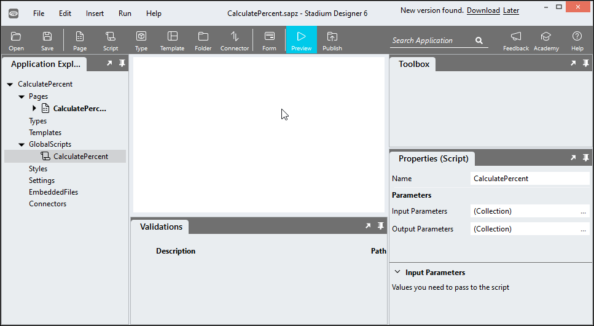

# Calculate Percent

A script to calculate percentages to specific decimal places

# Version 

1.0 Initial

# Global Script Setup
1. Create a Global Script called "CalculatePercentage"
2. Add the input parameters below to the Global Script
   1. Total
   2. Value
   3. Precision
3. Add the output parameter below to the Global Script
   1. Result
4. Drag a *JavaScript* action into the script
5. Add the Javascript below into the JavaScript code property
```javascript
/* Stadium Script Version 1.0*/
let value = ~.Parameters.Input.Value;
let total = ~.Parameters.Input.Total;
if (isNaN(parseFloat(value)) || isNaN(parseFloat(total))) {
	console.error("Parameters 'Total' and 'Value' must be valid numbers");
	return false;
}
let precision = ~.Parameters.Input.Precision;
if (isNaN(parseFloat(precision))) precision = 2;
return ((value / total) * 100).toFixed(precision);
```
6. Drag a *SetValue* action into the Global Script and place it under the *JavaScript* action
   1. Target: = ~.Parameters.Output.Result
   2. Value: = ~.Javascript



## Usage
1. Drag the script called "CalculatePercentage" into a script or event handler
2. Enter values for the script input parameters
   1. Total: Float
   2. Value: Float
   3. Precision: Integer (default: 2)